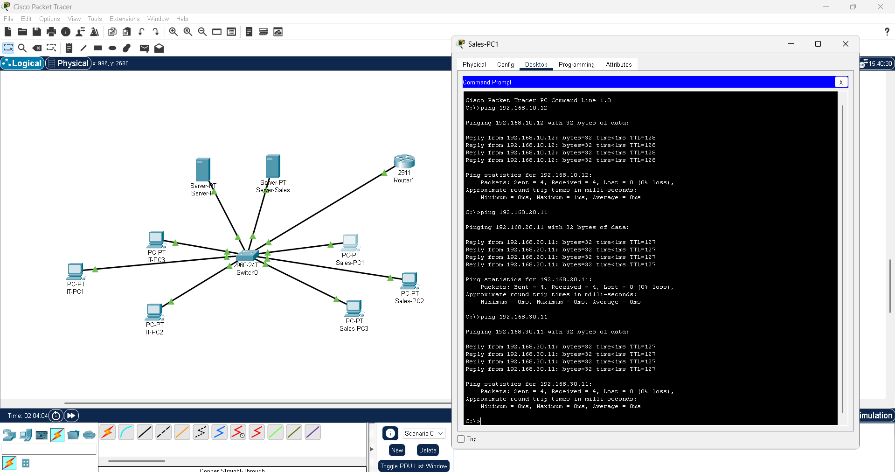
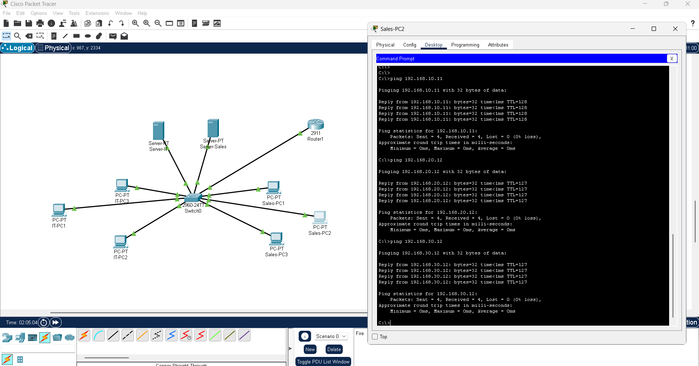
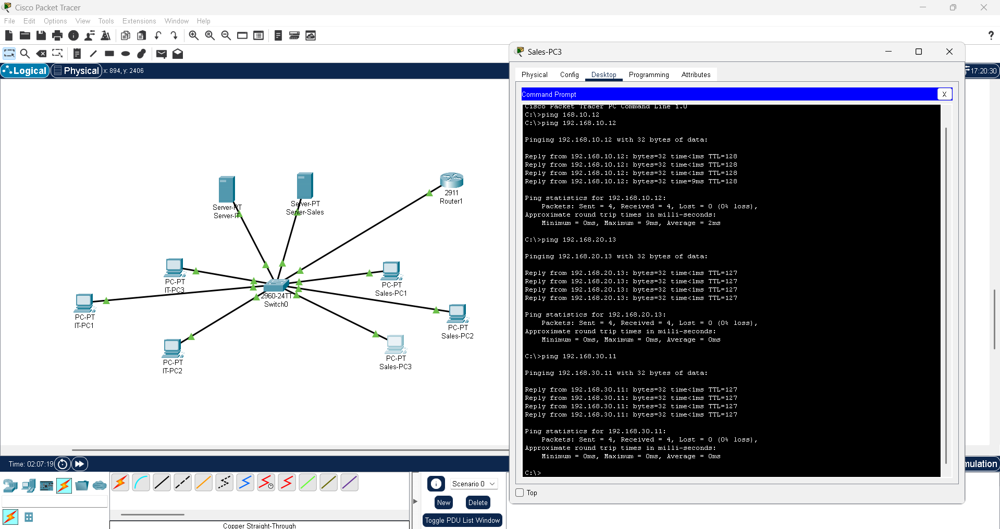
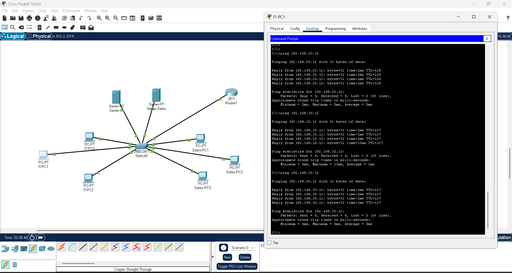
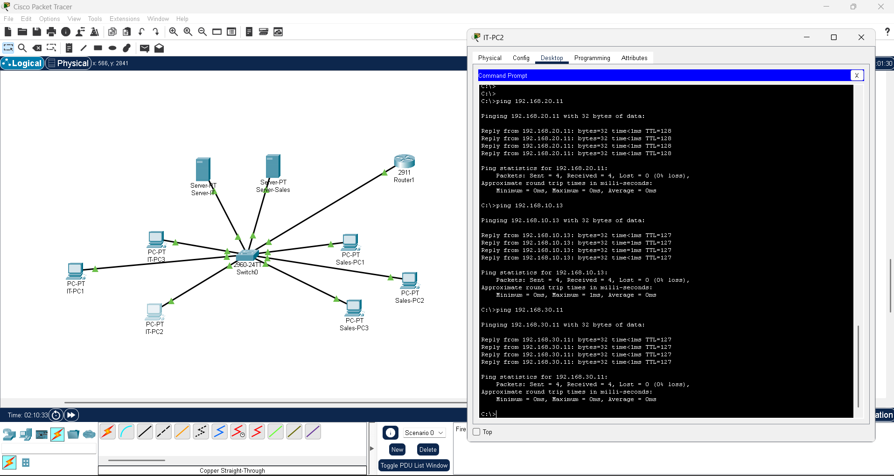
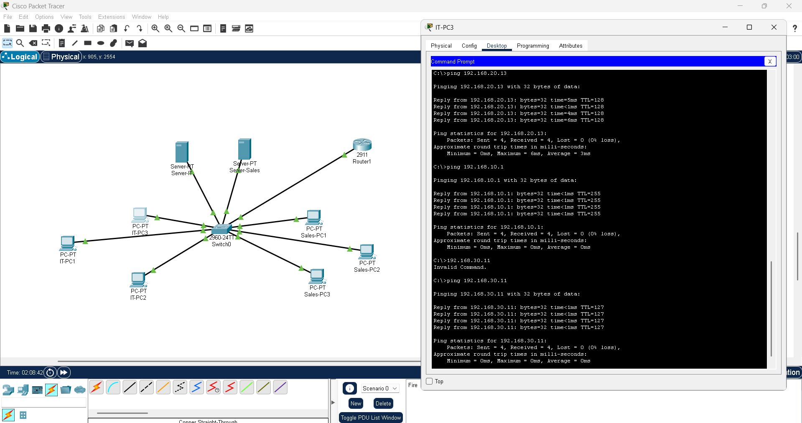
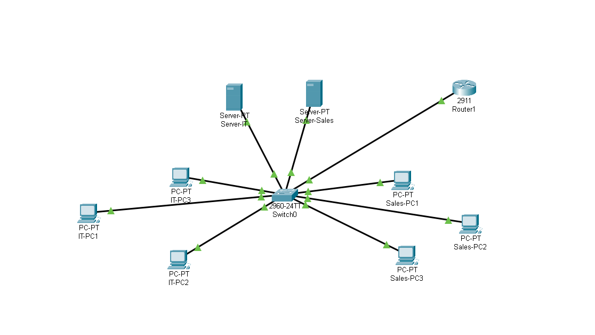

# LAN Setup and Architecture 🏗️

## Overview 📝
In this project, I designed and implemented a LAN using Cisco Packet Tracer and configured IP addresses in PCs to simulate a corporate network. I created VLANs for different departments, set up DHCP and DNS services, and tested connectivity.

---

## What I Did 🎯

## 1. Designing VLANs in Cisco Packet Tracer 🖧
- Created three VLANs:  
  - VLAN 10 – Sales  
  - VLAN 20 – IT  
  - VLAN 30 – Servers
- Configured VLAN IDs and assigned ports to the correct VLAN on the switch.
- Commands used on Cisco switch:
```

Switch> enable
Switch# configure terminal
Switch(config)# vlan 10
Switch(config-vlan)# name Sales
Switch(config)# vlan 20
Switch(config-vlan)# name IT
Switch(config)# vlan 30
Switch(config-vlan)# name Servers

Switch(config)# interface range fa0/10 - 12
Switch(config-if-range)# switchport mode access
Switch(config-if-range)# switchport access vlan 10

Switch(config)# interface range fa0/1 - 3
Switch(config-if-range)# switchport mode access
Switch(config-if-range)# switchport access vlan 20

Switch(config)# interface range fa0/20 - 21
Switch(config-if-range)# switchport mode access
Switch(config-if-range)# switchport access vlan 30

```


Configured subinterfaces on the router for each VLAN:

```
Router> enable
Router# configure terminal

! VLAN 10 – Sales
Router(config)# interface g0/0.10
Router(config-subif)# encapsulation dot1Q 10
Router(config-subif)# ip address 192.168.10.1 255.255.255.0

! VLAN 20 – IT
Router(config)# interface g0/0.20
Router(config-subif)# encapsulation dot1Q 20
Router(config-subif)# ip address 192.168.20.1 255.255.255.0


! VLAN 30 – IT
Router(config)# interface g0/0.30
Router(config-subif)# encapsulation dot1Q 30
Router(config-subif)# ip address 192.168.30.1 255.255.255.0

Router# write

```

Trunk Port Configuration

Configured the switch port connecting to the router as a trunk:

```
Switch(config)# interface g0/9  ! port connected to router
Switch(config-if)# switchport mode trunk
Switch(config-if)# switchport trunk allowed vlan 10,20
Switch(config)# write

```

---

## 2. IP Assignment for PCs and Servers 💻🗄️

| Device         | IP Address       | Subnet Mask     | Default Gateway  | DNS Server  |  VLAN  |
|----------------|----------------|----------------|----------------|---------------|-------|
| Sales PC1      | 192.168.10.11  | 255.255.255.0  | 192.168.10.1   | 192.168.10.11 | 10    |
| Sales PC2      | 192.168.10.12  | 255.255.255.0  | 192.168.10.1   | 192.168.10.12 | 10    |
| Sales PC3      | 192.168.10.13  | 255.255.255.0  | 192.168.10.1   | 192.168.10.13 | 10    |
| Sales Server   | 192.168.30.12  | 255.255.255.0  | 192.168.10.1   | 192.168.30.12 | 30    |
| IT PC1         | 192.168.20.11  | 255.255.255.0  | 192.168.20.1   | 192.168.20.11 | 20    |
| IT PC2         | 192.168.20.12  | 255.255.255.0  | 192.168.20.1   | 192.168.20.12 | 20    |
| IT PC3         | 192.168.20.13  | 255.255.255.0  | 192.168.20.1   | 192.168.20.13 | 20    |
| IT Server      | 192.168.30.11  | 255.255.255.0  | 192.168.20.1   | 192.168.30.11 | 30    |


---

## 3. Connectivity Testing ✅

- **Intra-VLAN ping:** All PCs can ping other PCs and their server within the same VLAN.  
- **Inter-VLAN ping:** PCs can ping devices in the other VLAN via Router-on-a-Stick.  
- **Server ping:** Both IT and Sales servers are reachable from all PCs.  

Screenshots: 
             
             
             
             
             

---

### 5. Visual Representation 📸
- Created a VLAN diagram in Cisco Packet Tracer showing:
  - Router 🌩️  
  - Core Switch 🖧  
  - VLAN 10 (Sales PCs)  
  - VLAN 20 (IT PCs)   
  - VLAN 30 (Servers)

Screenshot: 

---

### Notes 📝
- This setup demonstrates **real hands-on LAN configuration skills** using Cisco Packet Tracer and Windows environments.  
- VLANs improve network segmentation and security.  
- DHCP and DNS servers simplify IP and name management.  
- Connectivity tests validate correct network setup.


---
