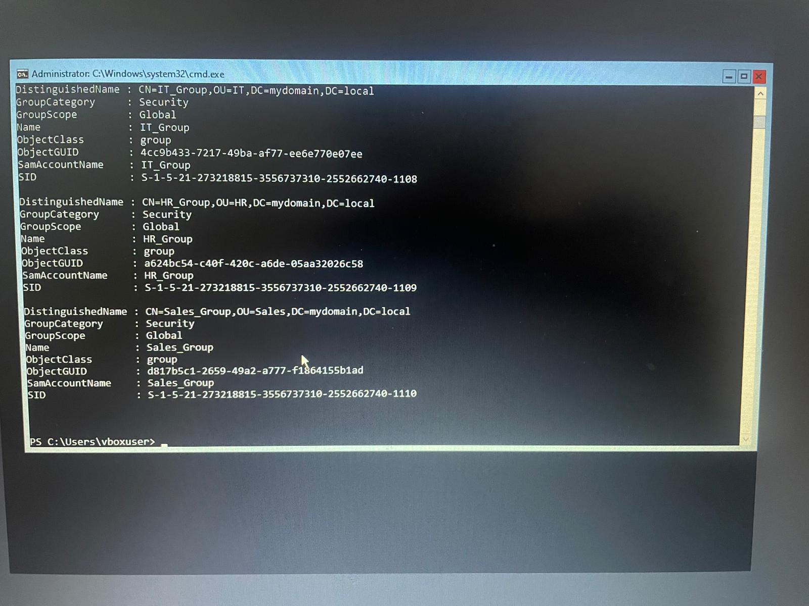

# 3️⃣ Creating Security Groups & Adding Members

**Goal:** Create security groups for each department and assign users to their respective groups.

---

## ✔️ Steps Taken

### **1️⃣ Create Groups**

Using PowerShell on Windows Server 2022 Core:

```powershell
New-ADGroup -Name "IT_Group" -GroupScope Global -GroupCategory Security -Path "OU=IT,DC=MyDomain,DC=local"
New-ADGroup -Name "HR_Group" -GroupScope Global -GroupCategory Security -Path "OU=HR,DC=MyDomain,DC=local"
New-ADGroup -Name "Sales_Group" -GroupScope Global -GroupCategory Security -Path "OU=Sales,DC=MyDomain,DC=local"
```
2️⃣ Add Users to Groups
```powershell

Add-ADGroupMember -Identity "IT_Group" -Members "AliceIT"
Add-ADGroupMember -Identity "HR_Group" -Members "BobHR"
Add-ADGroupMember -Identity "Sales_Group" -Members "CarolSales"
```
📝 Notes
All groups are Global Security Groups, ideal for departmental access.

Users were successfully linked to their respective OUs earlier.

PowerShell confirms successful group creation with no errors.




