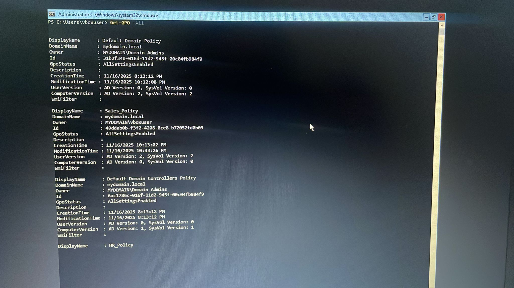
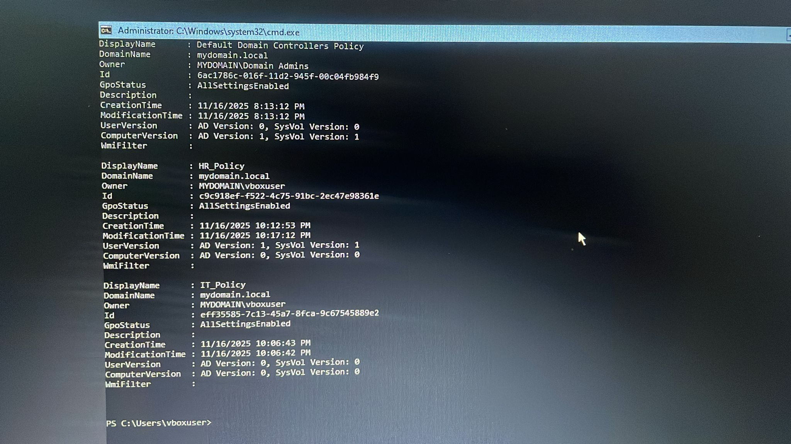

# 4️⃣ Group Policy Setup & Enforcement

**Goal:** Create and link Group Policies (GPOs) for different departments and apply basic security settings using PowerShell.

---

## ✔️ Steps Taken

### **1️⃣ Import Group Policy Module**

```powershell
Import-Module GroupPolicy
2️⃣ Create GPOs for Departments
```powershell

New-GPO -Name "IT_Policy"
New-GPO -Name "HR_Policy"
New-GPO -Name "Sales_Policy"
```
3️⃣ Link GPOs to Their OUs
```powershell

New-GPLink -Name "IT_Policy" -Target "OU=IT,DC=MyDomain,DC=local"
New-GPLink -Name "HR_Policy" -Target "OU=HR,DC=MyDomain,DC=local"
New-GPLink -Name "Sales_Policy" -Target "OU=Sales,DC=MyDomain,DC=local"
```
4️⃣ Example: Basic Password Policy (Domain Level)

```powershell

Set-ADDefaultDomainPasswordPolicy `
-ComplexityEnabled $true `
-MinPasswordLength 8 `
-HistoryCount 5 `
-MaxPasswordAge 30.00:00:00
```
5️⃣ Example: Restrict Control Panel for HR Department
(This is user-based, so users must log in once for it to apply.)

```powershell

Set-GPRegistryValue -Name "HR_Policy" `
-Key "Software\Microsoft\Windows\CurrentVersion\Policies\Explorer" `
-ValueName "NoControlPanel" `
-Type DWord `
-Value 1 `
-Context User
```



